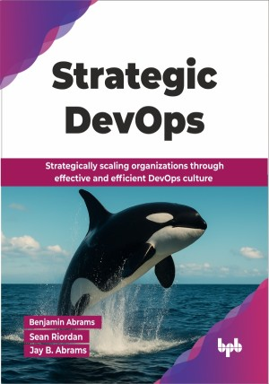

# Strategic DevOps 

Strategically scaling organizations through effective and efficient DevOps culture.

This is the repository for [Strategic DevOps
](https://bpbonline.com/products/strategic-devops?_pos=1&_sid=294a91477&_ss=r&variant=44720577577160?variant=44720577577160),published by BPB Publications.

## About the Book
DevOps is not something you can buy or install, even if some product names might suggest otherwise. This book helps you connect the dots between DevOps culture, technical execution, and business value, offering a practical framework to scale your organization in a world increasingly shaped by rapid change and the growing influence of AI.

While DevOps principles apply broadly, we focus on the developer, operator, and business triad to keep things grounded and actionable. We explore how DevOps culture influences everything from planning and automation to testing, cybersecurity, and observability. Along the way, we take a step back from the technical, asking: what does value actually mean?, and how can DevOps culture create, protect, and scale it?

Scaling technology is easy. Scaling people and culture is the real challenge, and this is where DevOps shines. After reading this book, you will move from mindset to execution, tying culture, metrics, and value together to understand how technical and human systems shape an organization's success.

## What You Will Learn
• Implementing DevOps culture principles. 

• Fostering collaboration and breaking organizational silos.

• Automation to development, deployment, and maintenance of a product or service.

• Integrating cybersecurity via shift left/right, threat modeling, and Zero Trust.

• Establishing useful metrics and KPIs for data-driven continuous improvement.

• Implementing observability, monitoring, alerting, and post-mortems for system health.

• Enabling better decision-making in organizations and businesses. 
